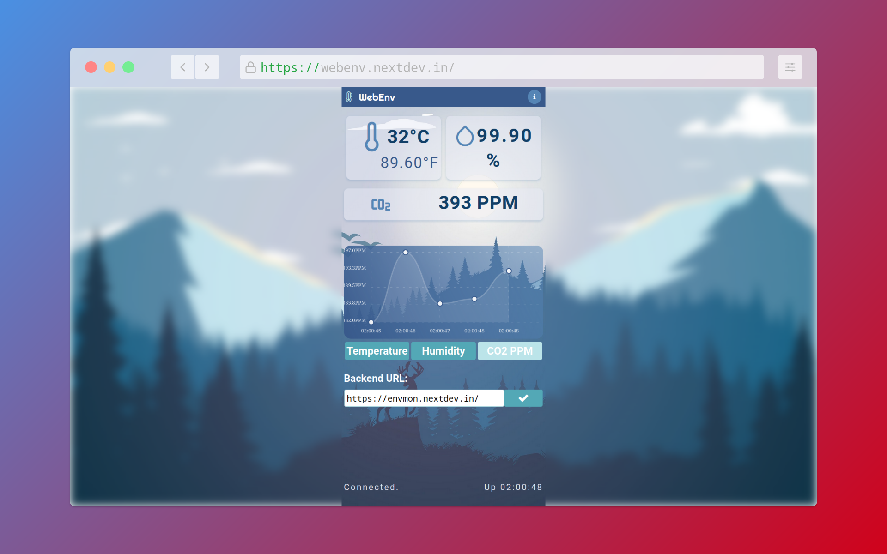
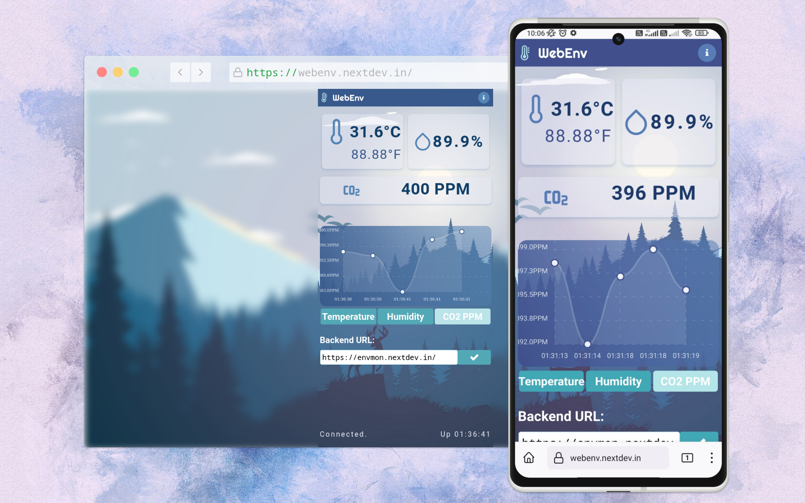

#  WebEnv

WebEnv is a React Native app which fetches and displays real-time data from the
ESP32 IoT device webserver ([envmon](https://github.com/furquan-lp/envmon-minimal)).

View a live web version here: [WebEnv at SimpleDev](https://webenv.simpledev.site/)

Learn more about it here: [Introducing WebEnv](https://tctp.xyz/)
